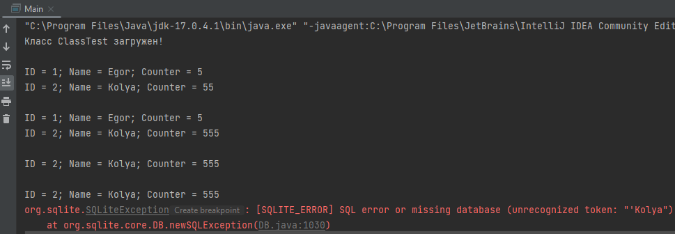

= Отчет по лабораторной работе 4
:listing-caption: Листинг
:figure-caption: Рис
:source-highlighter: coderay

Студент: Курочкин Егор и Вороненков Николай

Группа: ПИМ-22

== 1. Постановка задачи

В процессе выполнения лабораторной работы необходимо выполнить следующие задачи:

. ClassLoader
    - Ознакомится с руководством по загрузке классов и ClassLoader
    - Продемонстрировать работу своего загрузчика классов
    - Определить разницу между своей и стандартной реализацией
. JDBC
    - Установить соединение с БД с помощью JDBC драйвера
    - Создать таблицу БД с помощью JDBC
    - Реализовать CRUD-методы для одной таблицы
    - Реализовать несколько запросов в БД, которые должны выполняться в рамках одной транзакции
. Exception
    - Обернуть методы для работы с БД в try/catch с откатом транзакций и закрытием соединения
    - Продемонстрировать в программе откат транзакции

== 2. Разработка задачи

=== 2.1 Структура проекта

Проект разделен на следующие директории:

doc:::
Данная документация

src:::
Исходный код лабораторной работы

== 3. Информация о реализации

=== 3.1 Задание 1

Для выполнения первого задания созданы следующие классы:

- ClassLoaderTest - реализация своего класслоадера.
- ClassTest - класс, который будет загружаться своим класслоадером.

В класс Main был добавлен метод testClassloader, демонстрирующий работу класслоадера.

.ClassLoaderTest
[source,java]
----
import java.io.ByteArrayOutputStream;
import java.io.InputStream;

public class ClassLoaderTest extends ClassLoader {

    private byte[] loadClassBytes(String name) {
        InputStream in = getClass().getClassLoader().getResourceAsStream(name.replace(".", "/") + ".class");
        ByteArrayOutputStream stream = new ByteArrayOutputStream();
        int length = 0;

        try {
            assert in != null;
            length = in.read();
            while (length != -1) {
                stream.write(length);
                length = in.read();
            }
        } catch (Exception e) {
            e.printStackTrace();
        }
        return stream.toByteArray();
    }

    @Override
    public Class<?> findClass(String name) {
        byte[] b = loadClassBytes(name);
        return defineClass(name, b, 0, b.length);
    }
}
----

.DemoClass

[source,java]
----
public class ClassTest{
    public static void classLoaded(String className){
        System.out.println("Класс " + className + " загружен!");
    }
}
----

.Main

[source,java]
----
public class Main {
    public static void testClassloader(String[] args) throws InstantiationException, IllegalAccessException, NoSuchMethodException, InvocationTargetException {
        ClassLoaderTest cl = new ClassLoaderTest();
        Class<?> c1 = cl.findClass("ClassTest");
        Object ob = c1.newInstance();
        Method method = c1.getMethod("classLoaded", String.class);
        method.invoke(ob, "ClassTest");
    }
}
----

Отличием ClassLoaderTest и стандартной реализацией является переопределенный метод findClass, а также то, что классы, загруженные через стандартные загрузчики Java не будут видеть этот класс.

=== 3.2 Задание 2 и 3

Для выполнения этого задания добавим в проект класс Main_db и библиотеку JDBC.

Реализована установка соединения с базой данных с использованием JDBC драйвера. Выполняется обновление, получение и удаление данных с таблицей

Функции находятся внутри try блока, в случае ошибки соединение и statement закрываются.

.Main_db
[source,java]
----
import java.sql.Connection;
import java.sql.DriverManager;
import java.sql.SQLException;
import java.sql.ResultSet;
import java.sql.Statement;

public class Main_db {
    private Connection connection = null;
    private Statement statement = null;

    public void connect() {
        try {
            connection = DriverManager.getConnection("jdbc:sqlite::memory:");
            connection.setAutoCommit(false);
            statement = connection.createStatement();
            statement.setQueryTimeout(30);  // set timeout to 30 sec.
        } catch (SQLException e) {
            this.close();
            e.printStackTrace();
        }
    }

    public void createTable(String name, String params) {
        try {
            statement.executeUpdate("CREATE TABLE IF NOT EXISTS " + name + " " + params);
        } catch (SQLException e) {
            this.rollback();
            this.close();
            e.printStackTrace();
        }
    }

    public void update(String query) {
        try {
            statement.executeUpdate(query);
        } catch (SQLException e) {
            this.rollback();
            this.close();
            e.printStackTrace();
        }
    }

    public ResultSet select(String query) {
        try {
            return statement.executeQuery(query);
        } catch (SQLException e) {
            this.close();
            return null;
        }
    }

    public void commit() {
        try {
            connection.commit();
        } catch (SQLException e) {
            this.rollback();
            this.close();
            e.printStackTrace();
        }
    }

    public void rollback() {
        try {
            connection.rollback();
        } catch (SQLException e) {
            this.close();
            e.printStackTrace();
        }
    }

    public void close() {
        try {
            if (connection != null) {
                connection.close();
                connection = null;
            }
        } catch (SQLException e) {
            e.printStackTrace();
        }
    }
}

----

.Main
[source,java]
----
    private static void test_db() {
        Main_db db = new Main_db();
        db.connect();

        db.createTable("test", "(id INTEGER PRIMARY KEY AUTOINCREMENT, name TEXT NOT NULL, counter INTEGER DEFAULT 0)");
        db.update("INSERT INTO test (name, counter) VALUES ('Egor', 5)");
        db.update("INSERT INTO test (name, counter) VALUES ('Kolya', 55)");
        db.commit();

        ResultSet rs = db.select("SELECT * from test");
        Print_db(db, rs);

        db.update("UPDATE test SET counter = 555 WHERE name = 'Kolya'");
        rs = db.select("SELECT * from test");
        Print_db(db, rs);

        db.update("DELETE FROM test WHERE name = 'Egor'");
        rs = db.select("SELECT * from test");
        Print_db(db, rs);
        db.commit();

        db.update("DELETE FROM test WHERE name = 'Egor'");
        db.rollback();
        rs = db.select("SELECT * from test");
        Print_db(db, rs);

        db.update("DELETE FROM test WHERE name = 'Kolya");

        db.close();
    }
----

== 3. Результаты выполнения

В результате выполнения лабораторной работы получены следующие java классы:

Main, ClassTest и ClassLoaderTest для демонстрации собственного загрузчика классов.

Main_db для демонстрации подключения к базе данных через драйвер JDBC, создания таблицы, выполнения CRUD-методов, в том числе завернутых в try/catch, а также для демонстрации отката транзакции.

Результат запуска Main

== 4. Вывод

В результате выполнения лабораторной работы получены навыки по созданию собственной реализации загрузчика классов. А также по работе с драйвером JDBC, а именно - подключении к базе данных, создании таблицы, выполнеии CRUD-методов, использовании транзакций.